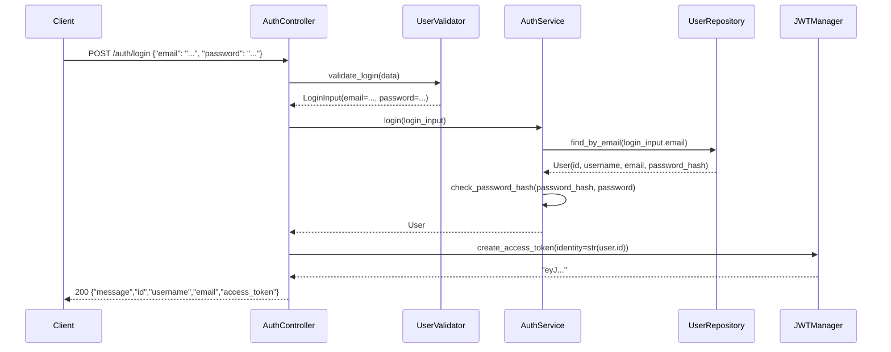
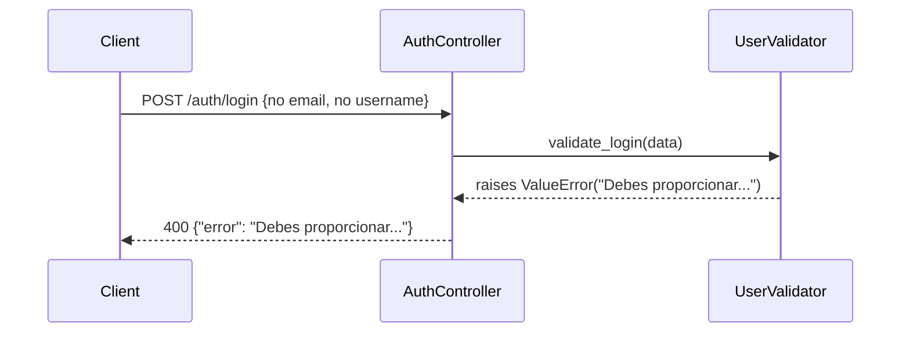
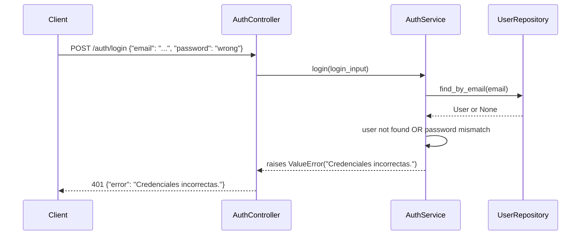

# Design Document — user-login

## Overview

The **user-login** feature provides credential-based authentication for registered users of the Flask REST API. A client submits an email (or username) and a plaintext password via `POST /auth/login`; the API validates the input, looks up the account, verifies the password against its bcrypt hash, and — on success — returns a signed JWT access token.

The implementation follows a strict layered architecture so that each concern (HTTP routing, business logic, data access, input validation) is isolated and independently testable. The token is issued by `flask-jwt-extended` and expires one hour after issuance.

**Scope**: the login flow only (`POST /auth/login`). Registration is out of scope.

---

## Architecture

The login request passes through four sequential layers. Each layer has a single responsibility and communicates with the next via typed data-transfer objects or domain model instances.

```mermaid
graph TD
    C[HTTP Client] -->|POST /auth/login\napplication/json| AC[AuthController\ncontrollers/auth_controller.py]
    AC -->|dict| UV[UserValidator\nschemas/user_schema.py]
    UV -->|LoginInput| AC
    AC -->|LoginInput| AS[AuthService\nservices/auth_service.py]
    AS -->|email or username| UR[UserRepository\nrepositories/user_repository.py]
    UR -->|User or None| AS
    AS -->|User| AC
    AC -->|str(user.id)| JWT[flask_jwt_extended\ncreate_access_token]
    JWT -->|access_token str| AC
    AC -->|200 JSON| C
```

### Sequence — Happy Path



### Sequence — Validation Error



### Sequence — Authentication Failure



---

## Components and Interfaces

### AuthController (`controllers/auth_controller.py`)

**Responsibility**: HTTP boundary — parse the request, delegate to the service layer, translate results and exceptions into HTTP responses.

| Aspect | Detail |
|---|---|
| Route | `POST /auth/login` |
| Content-Type | `application/json` |
| Success response | `200` with `{message, id, username, email, access_token}` |
| Validation error | `400` with `{error: <message>}` |
| Auth failure | `401` with `{error: "Credenciales incorrectas."}` |
| Never returns | `password` or `password_hash` fields |

**Contract**:
- Calls `UserValidator.validate_login(data: dict) -> LoginInput`; catches `ValueError` → 400.
- Calls `AuthService.login(input: LoginInput) -> User`; catches `ValueError` → 401.
- Calls `create_access_token(identity=str(user.id))` on success.

### UserValidator (`schemas/user_schema.py`)

**Responsibility**: Input sanitization and structural validation. Raises `ValueError` with user-facing messages; never raises any other exception type for expected inputs.

| Input rule | Behaviour on violation |
|---|---|
| No `email` and no `username` | `ValueError("Debes proporcionar un correo electrónico o nombre de usuario.")` |
| `email` present but doesn't match `^[^@\s]+@[^@\s]+\.[^@\s]+$` | `ValueError("El correo electrónico no es válido.")` |
| `username` present, stripped length < 3 | `ValueError("El nombre de usuario debe tener al menos 3 caracteres.")` |
| `password` absent or empty string | `ValueError("La contraseña es requerida.")` |

**Normalization on success**:
- `email` → `input.strip().lower()`
- `username` → `input.strip()` (only set when no email provided)
- `password` → raw value, no transformation

**Returns**: `LoginInput(email, username, password)` where at most one of `email`/`username` is set.

### AuthService (`services/auth_service.py`)

**Responsibility**: Business logic — account lookup routing and password verification.

| Step | Detail |
|---|---|
| Lookup routing | If `login_input.email` is set, call `find_by_email`; otherwise call `find_by_username` |
| User not found | `ValueError("Credenciales incorrectas.")` |
| Password check | `werkzeug.security.check_password_hash(user.password_hash, password)` |
| Wrong password | `ValueError("Credenciales incorrectas.")` |
| Success | Return the `User` model instance |

**Security invariant**: The error message for a non-existent account and for a wrong password is byte-for-byte identical. This prevents account enumeration. The current implementation satisfies this via a single `if not user or not check_password_hash(...)` branch.

### UserRepository (`repositories/user_repository.py`)

**Responsibility**: Data access — all SQLAlchemy queries for the `users` table.

| Method | Query |
|---|---|
| `find_by_email(email: str) -> User \| None` | `User.query.filter_by(email=email).first()` |
| `find_by_username(username: str) -> User \| None` | `User.query.filter_by(username=username).first()` |

Returns `None` when no record is found; never raises exceptions for "not found".

---

## Data Models

### User (SQLAlchemy model — `models/user.py`)

| Column | Type | Constraints | Notes |
|---|---|---|---|
| `id` | `Integer` | Primary key, auto-increment | Used as JWT `identity` |
| `username` | `String(80)` | Unique, not null | 3+ chars after strip |
| `email` | `String(120)` | Unique, not null | Stored lowercase |
| `password_hash` | `String(256)` | Not null | Werkzeug bcrypt hash; plaintext never stored |

### LoginInput (data-transfer object — `schemas/user_schema.py`)

```python
@dataclass
class LoginInput:
    password: str
    email: str | None = None
    username: str | None = None
```

### JWT Access Token

| Claim | Value | Source |
|---|---|---|
| `sub` (identity) | `str(user.id)` | `create_access_token(identity=str(user.id))` |
| `exp` | now + 1 hour | `JWT_ACCESS_TOKEN_EXPIRES = timedelta(hours=1)` in `config.py` |
| `iat` | current UTC timestamp | Automatic (flask-jwt-extended) |

### Request / Response Shapes

Login request (email variant):
```json
{ "email": "user@example.com", "password": "plaintext-password" }
```

Login request (username variant):
```json
{ "username": "johndoe", "password": "plaintext-password" }
```

Success response:
```json
{
  "message": "Login exitoso.",
  "id": 42,
  "username": "johndoe",
  "email": "john@example.com",
  "access_token": "eyJ..."
}
```

Error response:
```json
{ "error": "<human-readable message>" }
```

---

## Correctness Properties

*A property is a characteristic or behavior that should hold true across all valid executions of a system — essentially, a formal statement about what the system should do. Properties serve as the bridge between human-readable specifications and machine-verifiable correctness guarantees.*

`UserValidator` and `AuthService` contain pure, deterministic logic that is well-suited to property-based testing. [`hypothesis`](https://hypothesis.readthedocs.io/) is the chosen PBT library for Python (`pip install hypothesis`).

---

### Property 1: Missing identifier always produces the correct error

*For any* dict that contains a non-empty `password` but neither a non-empty `email` key nor a non-empty `username` key, calling `UserValidator.validate_login` shall raise `ValueError` with the message `"Debes proporcionar un correo electrónico o nombre de usuario."`.

**Validates: Requirements 2.1**

---

### Property 2: Invalid email format is always rejected

*For any* string that does not match `^[^@\s]+@[^@\s]+\.[^@\s]+$` (after strip + lowercase), providing it as the `email` value together with a non-empty `password` shall cause `UserValidator.validate_login` to raise `ValueError` with the message `"El correo electrónico no es válido."`.

**Validates: Requirements 2.2**

---

### Property 3: Short username is always rejected

*For any* string whose stripped length is less than 3, providing it as the `username` value (with no `email` field and a non-empty `password`) shall cause `UserValidator.validate_login` to raise `ValueError` with the message `"El nombre de usuario debe tener al menos 3 caracteres."`.

**Validates: Requirements 2.3**

---

### Property 4: Empty or absent password is always rejected

*For any* dict containing a valid identifier (a conforming email or a username of 3+ stripped chars) but with `password` absent, `None`, or empty string, `UserValidator.validate_login` shall raise `ValueError` with the message `"La contraseña es requerida."`.

**Validates: Requirements 2.4**

---

### Property 5: Input normalization is applied consistently

*For any* valid email string (including those with leading/trailing whitespace or uppercase letters), `UserValidator.validate_login` shall return a `LoginInput` where `email == raw_email.strip().lower()` and `username is None`.

*For any* valid username string (including those with leading/trailing whitespace), `UserValidator.validate_login` shall return a `LoginInput` where `username == raw_username.strip()` and `email is None`.

**Validates: Requirements 2.6**

---

### Property 6: Lookup is routed to the correct repository method

*For any* `LoginInput` with a non-`None` `email`, `AuthService.login` shall invoke `UserRepository.find_by_email` with that email value and shall never invoke `find_by_username`.

*For any* `LoginInput` with `email` equal to `None` and a non-`None` `username`, `AuthService.login` shall invoke `UserRepository.find_by_username` with that username value and shall never invoke `find_by_email`.

**Validates: Requirements 3.1, 3.2**

---

### Property 7: Credential failure is always reported with the same message, preventing account enumeration

*For any* `LoginInput`, if `AuthService.login` raises a `ValueError`, the exception message shall be exactly `"Credenciales incorrectas."` regardless of whether the failure was caused by a non-existent account (repository returns `None`) or a wrong password (hash mismatch). The two messages must be byte-for-byte identical.

**Validates: Requirements 3.3, 4.2, 4.3**

---

### Property 8: JWT identity is always the string representation of the user ID

*For any* `User` record with a given `id` (any positive integer), when `AuthController` receives that user from `AuthService.login`, it shall call `create_access_token` with `identity == str(user.id)`.

**Validates: Requirements 5.1**

---

### Property 9: Success response contains all required fields and no sensitive fields

*For any* `User` record with valid `id`, `username`, and `email`, when `AuthService.login` returns that user, the HTTP response from `AuthController` shall:
- have status code `200`
- contain the fields `message`, `id`, `username`, `email`, and `access_token`
- have `id == user.id`, `username == user.username`, and `email == user.email`
- **not** contain the keys `password` or `password_hash`

**Validates: Requirements 5.3, 5.4, 7.2**

---

### Property 10: No HTTP 500 responses for any JSON-parseable input

*For any* JSON-serializable dict sent as the body of `POST /auth/login` (including empty objects, objects missing required fields, objects with incorrect types, and objects with extra fields), the HTTP response status code shall never be `500`.

**Validates: Requirements 6.3**

---

## Error Handling

The login flow uses a two-tier exception strategy: `ValueError` is the single type used to signal expected, user-facing failures. All other exceptions propagate as unhandled (resulting in Flask's default 500 behavior for truly unexpected errors, e.g., database unavailability).

### Error Response Table

| Condition | Layer that raises | HTTP status | `error` message |
|---|---|---|---|
| Body missing or not JSON | `AuthController` (silent fallback → empty dict) | `400` | Per validation rule triggered |
| No email and no username | `UserValidator` | `400` | `"Debes proporcionar un correo electrónico o nombre de usuario."` |
| Invalid email format | `UserValidator` | `400` | `"El correo electrónico no es válido."` |
| Username < 3 chars (stripped) | `UserValidator` | `400` | `"El nombre de usuario debe tener al menos 3 caracteres."` |
| Empty or absent password | `UserValidator` | `400` | `"La contraseña es requerida."` |
| Account not found | `AuthService` | `401` | `"Credenciales incorrectas."` |
| Wrong password | `AuthService` | `401` | `"Credenciales incorrectas."` |

### Design Decisions

**Unified 401 message**: Both "user not found" and "wrong password" paths produce identical error messages. This is an intentional security decision to prevent account enumeration (see Property 7). The current `AuthService.login` implementation satisfies this with a single `if not user or not check_password_hash(...)` guard.

**No 500 for foreseeable inputs**: All expected failure modes are caught as `ValueError` within the controller. The controller uses `request.get_json(silent=True)` so that a non-JSON body or absent `Content-Type` does not raise an exception — it returns `{}`, which then triggers validation errors normally.

**No plaintext password logging**: The controller never logs the request body. `AuthService` never stores or returns the `password` field beyond the duration of a single function call frame.

---

## Testing Strategy

### Dual Approach

Unit/property tests verify isolated logic. The existing smoke tests verify the fully wired-up flow end-to-end. Both layers are complementary.

### Property-Based Testing (Hypothesis)

**Library**: [`hypothesis`](https://hypothesis.readthedocs.io/) — the standard PBT library for Python.

```
pip install hypothesis
```

Each property test runs a minimum of **100 iterations** (configured via `@settings(max_examples=100)`). Each test is tagged with a comment referencing the design property.

**Tag format**: `# Feature: user-login, Property {N}: {property_summary}`

#### Property Test Sketches

```python
from hypothesis import given, settings, strategies as st
from werkzeug.security import generate_password_hash
import pytest

from schemas.user_schema import UserValidator, LoginInput
from services.auth_service import AuthService

EMAIL_REGEX = re.compile(r"^[^@\s]+@[^@\s]+\.[^@\s]+$")

# Feature: user-login, Property 1: missing identifier always produces the correct error
@given(password=st.text(min_size=1))
@settings(max_examples=100)
def test_no_identifier_raises(password):
    data = {"password": password}
    with pytest.raises(ValueError, match="Debes proporcionar"):
        UserValidator().validate_login(data)


# Feature: user-login, Property 2: invalid email format is always rejected
@given(
    email=st.text().filter(lambda s: bool(s.strip()) and not EMAIL_REGEX.match(s.strip().lower())),
    password=st.text(min_size=1),
)
@settings(max_examples=100)
def test_invalid_email_rejected(email, password):
    data = {"email": email, "password": password}
    with pytest.raises(ValueError, match="El correo electrónico no es válido"):
        UserValidator().validate_login(data)


# Feature: user-login, Property 3: short username is always rejected
@given(
    username=st.text(max_size=2),
    password=st.text(min_size=1),
)
@settings(max_examples=100)
def test_short_username_rejected(username, password):
    data = {"username": username, "password": password}
    with pytest.raises(ValueError, match="El nombre de usuario debe tener al menos 3 caracteres"):
        UserValidator().validate_login(data)


# Feature: user-login, Property 4: empty or absent password is always rejected
@given(email=st.just("user@example.com"))
@settings(max_examples=100)
def test_empty_password_rejected(email):
    for bad_password in ["", None]:
        data = {"email": email, "password": bad_password} if bad_password is not None else {"email": email}
        with pytest.raises(ValueError, match="La contraseña es requerida"):
            UserValidator().validate_login(data)


# Feature: user-login, Property 5: input normalization is applied consistently
@given(
    local=st.text(min_size=1, alphabet=st.characters(whitelist_categories=("Ll", "Lu", "Nd"))),
    padding=st.text(alphabet=" ", max_size=3),
    password=st.text(min_size=1),
)
@settings(max_examples=100)
def test_email_normalization(local, padding, password):
    raw = f"{padding}{local}@example.com{padding}"
    data = {"email": raw, "password": password}
    result = UserValidator().validate_login(data)
    assert result.email == raw.strip().lower()
    assert result.username is None


# Feature: user-login, Property 7: credential failure prevents account enumeration
@given(email=st.emails(), password=st.text(min_size=1))
@settings(max_examples=100)
def test_credential_failure_uniformity(email, password):
    class RepoNone:
        def find_by_email(self, e): return None
        def find_by_username(self, u): return None

    class RepoWrongHash:
        def find_by_email(self, e):
            from models.user import User
            u = User.__new__(User)
            u.id, u.username, u.email = 1, "u", e
            u.password_hash = generate_password_hash("definitely_different_" + password)
            return u
        def find_by_username(self, u): return None

    input_ = LoginInput(email=email, password=password)

    with pytest.raises(ValueError) as exc_no_user:
        AuthService(RepoNone()).login(input_)

    with pytest.raises(ValueError) as exc_wrong_pass:
        AuthService(RepoWrongHash()).login(input_)

    assert str(exc_no_user.value) == str(exc_wrong_pass.value) == "Credenciales incorrectas."


# Feature: user-login, Property 10: no HTTP 500 for any JSON-parseable input
@given(body=st.dictionaries(
    keys=st.text(max_size=20),
    values=st.one_of(st.text(), st.integers(), st.none(), st.booleans()),
    max_size=5,
))
@settings(max_examples=200)
def test_no_500_for_any_input(client, body):
    resp = client.post("/auth/login", json=body)
    assert resp.status_code != 500
```

### Unit Tests (Example-Based)

Focused on specific scenarios that complement properties:

| Scenario | Layer under test | Expected result |
|---|---|---|
| Valid email + correct password → end-to-end | AuthController (Flask test client) | 200, all required fields, no `password_hash` |
| Valid username + correct password | AuthController | 200, `username` matches |
| Valid email + wrong password | AuthController | 401, `{"error": "Credenciales incorrectas."}` |
| Non-existent email + any password | AuthController | 401, same error message |
| Body is `{}` | AuthController | 400 |
| Body is absent / non-JSON | AuthController | 400 |
| `create_access_token` called with `str(user.id)` | AuthController (mocked service) | Mock assertion passes |
| Correct password accepted | AuthService (mocked repo) | Returns User |
| Wrong password rejected | AuthService (mocked repo) | `ValueError("Credenciales incorrectas.")` |

### Integration / Smoke Tests

The existing `smoke_test_login.py` covers the four primary scenarios against an in-memory SQLite database via the Flask test client. These constitute the integration layer and are sufficient for end-to-end verification of the wired flow.

```
python smoke_test_login.py
```

### Test File Layout

```
tests/
├── unit/
│   ├── test_user_validator.py      # Property tests for Properties 1–5 + example edge cases
│   ├── test_auth_service.py        # Property tests for Properties 6–7 + example tests
│   └── test_auth_controller.py     # Property tests for Properties 8–10 + unit examples
└── integration/
    └── smoke_test_login.py         # Existing end-to-end smoke tests
```
