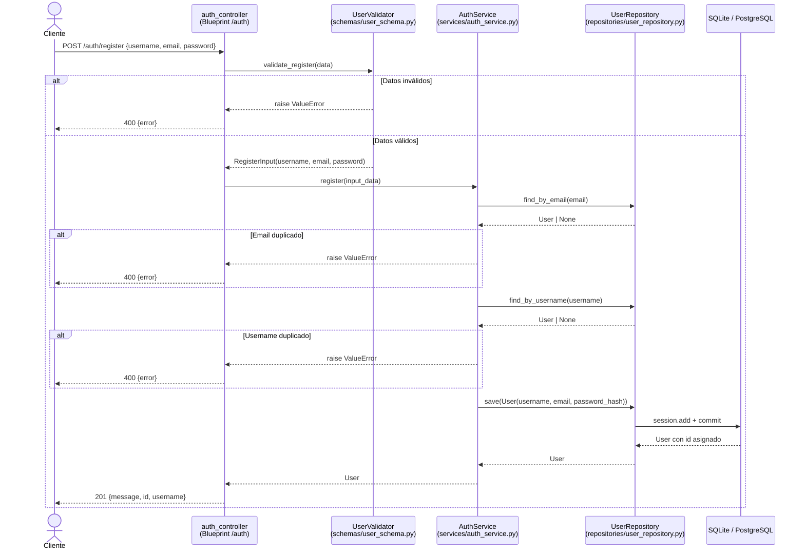

# Design Document — user-registration

## Overview

Esta feature implementa el registro de nuevos usuarios a través del endpoint `POST /auth/register` en una API REST construida con Flask. El flujo completo recorre cuatro capas bien delimitadas: el controlador recibe la solicitud HTTP, el validador limpia y verifica los datos de entrada, el servicio de negocio aplica las reglas de unicidad y crea el usuario con contraseña hasheada, y el repositorio persiste el objeto en la base de datos.

El diseño no introduce nuevas dependencias ni modifica la arquitectura existente. Documenta, formaliza y especifica el comportamiento correcto del código ya escrito, de forma que pueda verificarse mediante pruebas automatizadas.

**Objetivo principal:** garantizar que cualquier solicitud de registro produce exactamente uno de dos resultados deterministas:
1. Un usuario nuevo persistido en la base de datos y una respuesta HTTP 201 con `{message, id, username}`.
2. Una respuesta HTTP 400 con `{error: <mensaje descriptivo>}` cuando los datos son inválidos o ya existen.

---

## Architecture

El registro sigue un flujo de capas unidireccional. Cada capa tiene una única responsabilidad y se comunica con la siguiente a través de interfaces bien definidas (dataclasses y excepciones `ValueError`).



### Decisiones de diseño

| Decisión | Alternativa descartada | Razón |
|---|---|---|
| `ValueError` como señal de error de negocio | Excepciones personalizadas | Mantener consistencia con el código existente; la granularidad es suficiente |
| Validación en `UserValidator` separada del servicio | Validar en el servicio | Separación clara: validación sintáctica vs. reglas de negocio |
| `RegisterInput` dataclass inmutable | Dict plano | Tipo explícito, sin sorpresas en campos faltantes, más fácil de testear |
| Werkzeug `generate_password_hash` | bcrypt directo | Ya es la dependencia de Flask-Login; no añade nueva dependencia |

---

## Components and Interfaces

### `UserValidator.validate_register(data: dict) -> RegisterInput`

**Responsabilidad:** Extraer, limpiar y validar los campos `username`, `email` y `password` del body JSON.

**Contrato de entrada:** cualquier `dict` (puede estar vacío, tener campos nulos, tipos incorrectos).

**Transformaciones aplicadas:**
- `username`: `(data.get("username") or "").strip()`
- `email`: `(data.get("email") or "").strip().lower()`
- `password`: `data.get("password") or ""`

**Reglas de validación (en orden):**

| Campo | Condición de rechazo | Mensaje de error |
|---|---|---|
| `username` | vacío o ausente tras strip | `"El nombre de usuario es requerido."` |
| `username` | longitud < 3 tras strip | `"El nombre de usuario debe tener al menos 3 caracteres."` |
| `email` | vacío, ausente o no coincide con `^[^@\s]+@[^@\s]+\.[^@\s]+$` | `"El correo electrónico no es válido."` |
| `password` | ausente o longitud < 6 | `"La contraseña debe tener al menos 6 caracteres."` |

**Retorno exitoso:** `RegisterInput(username=stripped, email=lowercase, password=raw)`

**Señal de error:** `raise ValueError(mensaje)`

---

### `AuthService.register(input_data: RegisterInput) -> User`

**Responsabilidad:** Aplicar reglas de unicidad y crear el objeto `User` con contraseña hasheada.

**Flujo:**
1. `repo.find_by_email(input_data.email)` → si no es `None`: `raise ValueError("Ya existe una cuenta con ese correo electrónico.")`
2. `repo.find_by_username(input_data.username)` → si no es `None`: `raise ValueError("El nombre de usuario ya está en uso.")`
3. Construir `User(username=..., email=..., password_hash=generate_password_hash(password))`
4. `repo.save(user)` → retornar el `User` persistido (con `id` asignado)

**Señal de error:** `raise ValueError(mensaje)` para duplicados; propaga excepciones de BD sin capturarlas.

---

### `UserRepository`

| Método | Firma | Comportamiento |
|---|---|---|
| `find_by_email` | `(email: str) -> User \| None` | `User.query.filter_by(email=email).first()` |
| `find_by_username` | `(username: str) -> User \| None` | `User.query.filter_by(username=username).first()` |
| `save` | `(user: User) -> User` | `db.session.add(user)` + `db.session.commit()` → retorna `user` |

---

### `auth_bp.register()` — Controlador

**Responsabilidad:** Orquestar las capas, traducir resultados a respuestas HTTP.

```python
@auth_bp.route("/register", methods=["POST"])
def register():
    try:
        input_data = _validator.validate_register(request.get_json(silent=True) or {})
        user = _service.register(input_data)
    except ValueError as exc:
        return jsonify({"error": str(exc)}), 400
    return jsonify({"message": "Usuario registrado.", "id": user.id, "username": user.username}), 201
```

El controlador no contiene lógica de negocio. Cualquier `ValueError` de cualquier capa se mapea a HTTP 400.

---

## Data Models

### `User` (SQLAlchemy Model)

```python
class User(db.Model):
    __tablename__ = "users"

    id            = db.Column(db.Integer, primary_key=True)          # autoincrement
    username      = db.Column(db.String(80), unique=True, nullable=False)
    email         = db.Column(db.String(120), unique=True, nullable=False)
    password_hash = db.Column(db.String(256), nullable=False)
```

**Restricciones de BD:**
- `username` y `email` tienen índices `UNIQUE` en la base de datos (garantía adicional a la validación en servicio).
- `password_hash` nunca almacena la contraseña en texto plano.

### `RegisterInput` (Dataclass — DTO)

```python
@dataclass
class RegisterInput:
    username: str   # stripped
    email: str      # lowercase
    password: str   # sin modificar (solo se usa para generar el hash)
```

`RegisterInput` es inmutable en la práctica: una vez construido por el validador, el servicio y el repositorio lo consumen como valor de solo lectura.

---

## Correctness Properties

*A property is a characteristic or behavior that should hold true across all valid executions of a system — essentially, a formal statement about what the system should do. Properties serve as the bridge between human-readable specifications and machine-verifiable correctness guarantees.*

---

### Property 1: Normalización de entrada válida

*Para cualquier* combinación de username válido (con posibles espacios extremos), email válido (con posibles mayúsculas) y password válido (≥ 6 caracteres), `validate_register` debe devolver un `RegisterInput` cuyo `username` sea el valor original sin espacios extremos, cuyo `email` sea el valor original en minúsculas y cuya `password` sea el valor original sin modificar.

**Validates: Requirements 1.6, 5.1, 5.2**

---

### Property 2: Rechazo de username inválido

*Para cualquier* string de username que, tras aplicar `.strip()`, tenga longitud 0, 1 o 2 caracteres (incluyendo cadenas vacías, solo espacios, o cadenas de 1–2 caracteres no vacíos), `validate_register` debe lanzar un `ValueError`.

**Validates: Requirements 1.2, 1.3**

---

### Property 3: Rechazo de email inválido

*Para cualquier* string que no coincida con el patrón `^[^@\s]+@[^@\s]+\.[^@\s]+$` (incluyendo cadenas vacías, sin `@`, sin dominio, con espacios), `validate_register` debe lanzar un `ValueError`.

**Validates: Requirements 1.4**

---

### Property 4: Rechazo de password corta

*Para cualquier* string de password de longitud menor a 6 caracteres (incluyendo cadena vacía), `validate_register` debe lanzar un `ValueError`.

**Validates: Requirements 1.5**

---

### Property 5: Rechazo por duplicado de email o username

*Para cualquier* `RegisterInput` válido, si el repositorio (mockeado) retorna un `User` existente para el `email` del input, `AuthService.register` debe lanzar un `ValueError`. De igual forma, si el email no está duplicado pero el `username` sí lo está, `AuthService.register` debe lanzar un `ValueError`.

**Validates: Requirements 2.1, 2.2**

---

### Property 6: Invariante del usuario guardado

*Para cualquier* `RegisterInput` válido (con email no duplicado y username no duplicado), el objeto `User` que `AuthService.register` pasa a `repo.save` debe satisfacer simultáneamente: `user.username == input_data.username`, `user.email == input_data.email`, `user.password_hash != input_data.password`, y `check_password_hash(user.password_hash, input_data.password) == True`.

**Validates: Requirements 3.1, 5.3**

---

### Property 7: Forma de la respuesta HTTP en registro exitoso

*Para cualquier* solicitud `POST /auth/register` con datos válidos y únicos, la respuesta debe tener código HTTP 201 y su cuerpo JSON debe contener los campos `message`, `id` y `username`, donde `username` coincide con el username del usuario creado.

**Validates: Requirements 4.1**

---

### Property 8: Forma de la respuesta HTTP en error

*Para cualquier* solicitud `POST /auth/register` que provoque un `ValueError` en el validador o en el servicio (datos inválidos, email duplicado, username duplicado), la respuesta debe tener código HTTP 400 y su cuerpo JSON debe contener el campo `error` con un mensaje no vacío.

**Validates: Requirements 4.2, 4.3**

---

## Error Handling

El manejo de errores sigue una estrategia de dos niveles:

### Errores de cliente (HTTP 400)

Todos los `ValueError` lanzados por `UserValidator` o `AuthService` son capturados en el controlador y transformados en `{"error": str(exc)}` con código 400. El mensaje es siempre descriptivo y en español, orientado al consumidor del API.

```
Posibles mensajes:
- "El nombre de usuario es requerido."
- "El nombre de usuario debe tener al menos 3 caracteres."
- "El correo electrónico no es válido."
- "La contraseña debe tener al menos 6 caracteres."
- "Ya existe una cuenta con ese correo electrónico."
- "El nombre de usuario ya está en uso."
```

### Errores de infraestructura

Las excepciones de base de datos (`SQLAlchemyError` y subclases) **no** son capturadas en el controlador de registro. Se propagan hacia el manejador de errores global de Flask (si existe) o resultan en HTTP 500. Esta es la decisión de diseño existente: `UserRepository.save` no silencia excepciones de BD.

**Recomendación:** registrar un `@app.errorhandler(Exception)` global que devuelva HTTP 500 con cuerpo `{"error": "Error interno del servidor."}` para no exponer trazas de stack al cliente.

### Race condition en unicidad

La verificación de unicidad (`find_by_email` → `find_by_username` → `save`) no es atómica. En escenarios de alta concurrencia, dos solicitudes simultáneas con el mismo email podrían pasar ambas las verificaciones antes de que una de las dos haga `commit`. En ese caso, la restricción `UNIQUE` de la base de datos lanzará una `IntegrityError` que se propagará como error 500.

**Mitigación sugerida** (fuera del alcance de esta feature): capturar `IntegrityError` en el repositorio o en el servicio y relanzarla como `ValueError` con mensaje amigable.

---

## Testing Strategy

### Herramientas

| Capa | Tipo de test | Herramienta |
|---|---|---|
| `UserValidator` | Property-based | `pytest` + `hypothesis` |
| `AuthService` | Property-based (con mocks) | `pytest` + `hypothesis` + `unittest.mock` |
| `auth_controller` | Property-based + example | `pytest` + `hypothesis` + Flask test client |
| `UserRepository` | Integration | `pytest` + SQLite en memoria |
| Endpoint completo | Example / edge case | `pytest` + Flask test client |

### Enfoque dual

Se combinan **pruebas basadas en propiedades** (para cubrir el espacio de inputs con ≥ 100 iteraciones por propiedad) con **pruebas de ejemplo** (para casos específicos, condiciones de error y flujos de integración). Las pruebas de propiedad son el mecanismo principal de verificación de correctitud; las pruebas de ejemplo cubren los puntos de integración y los casos borde concretos.

### Property-based tests (hypothesis)

Cada prueba de propiedad debe:
- Ejecutar un mínimo de **100 iteraciones** (configurado con `@settings(max_examples=100)`).
- Incluir un comentario con el tag de trazabilidad en el formato:
  `# Feature: user-registration, Property N: <texto de la propiedad>`

| Propiedad | Generadores hypothesis sugeridos |
|---|---|
| P1 — Normalización | `st.text(min_size=3)` para username, emails válidos generados componiedo partes, `st.text(min_size=6)` para password |
| P2 — Rechazo username inválido | `st.one_of(st.just(""), st.text(alphabet=st.characters(blacklist_categories=('Zs',)), max_size=2), st.text(alphabet=" \t\n", min_size=1))` |
| P3 — Rechazo email inválido | `st.text()` filtrado para no coincidir con EMAIL_REGEX |
| P4 — Rechazo password corta | `st.text(max_size=5)` |
| P5 — Rechazo por duplicado | `st.builds(RegisterInput, ...)` con repo mockeado para retornar un User |
| P6 — Invariante usuario guardado | `st.builds(RegisterInput, ...)` con repo mockeado, verificar campos del User pasado a save |
| P7 — Respuesta 201 | `st.builds(RegisterInput, ...)` via Flask test client con DB en memoria |
| P8 — Respuesta 400 | Inputs inválidos generados, via Flask test client |

### Example-based tests

- Registro exitoso end-to-end con DB SQLite en memoria (cubre Req 3.2).
- Registro con body no-JSON (cubre Req 4.4).
- Registro con DB que lanza `SQLAlchemyError` para verificar propagación (cubre Req 3.3).
- Re-registro con mismo email — verifica 400 (cubre Req 2.3 como flujo completo).

### Estructura de archivos de test sugerida

```
tests/
  unit/
    test_user_validator.py      # Properties P1–P4
    test_auth_service.py        # Properties P5–P6
  integration/
    test_auth_controller.py     # Properties P7–P8 + examples
    test_user_repository.py     # Integration: save + find_by_*
```
